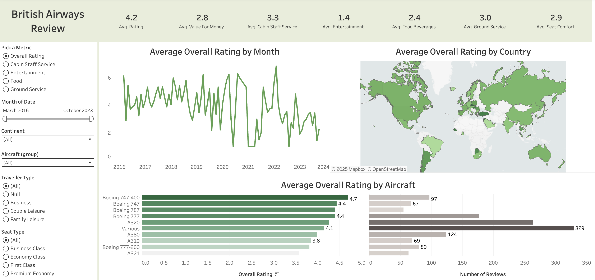

# British Airways Review

## Dashboard Features
  - Interactive filters allow users to explore data by selecting from the left-hand panel or clicking directly on charts and graphs.
  - Hovering over visual elements reveals precise values and insights.'
## Key Questions Answered
  - What is British Airways doing well, and how can they improve customer satisfaction?
  - Which aircraft types receive the highest customer satisfaction ratings?
  - How do traveler type (e.g., business, leisure) and seat type (e.g., economy, business class) affect satisfaction?
  - How do seasonal trends impact service quality and customer reviews?

## Use Case
  - This dashboard is designed to help stakeholders understand patterns in customer satisfaction and identify actionable opportunities to improve service delivery.

## Project Website: [Link](https://public.tableau.com/app/profile/saad.abdullah5369/viz/SA_British_Airways_Review/Ratings?publish=yes)

## Dataset
**ba_reviews.csv** joined on Place to Country in **Countries.csv**

