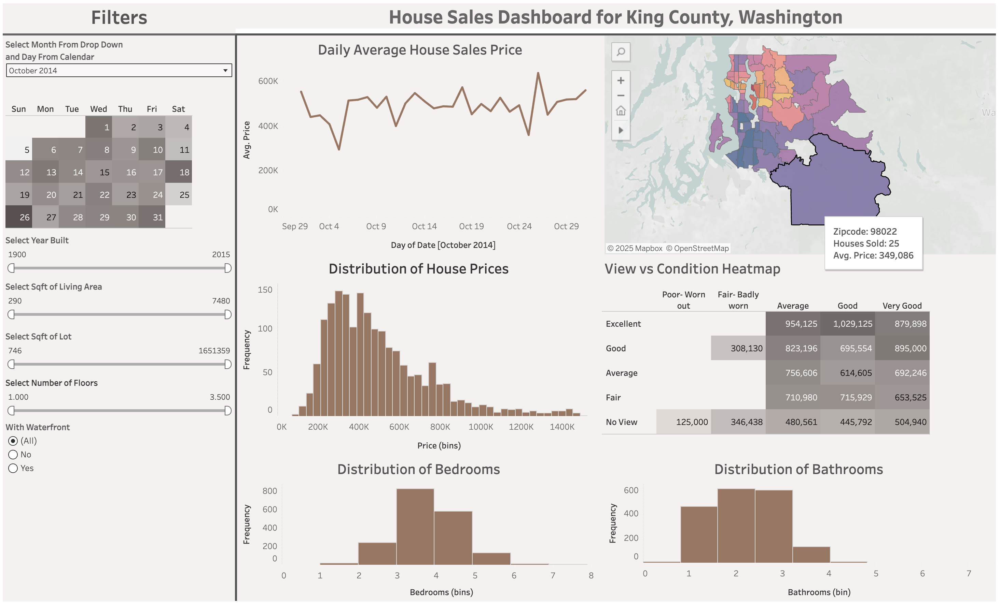

# House Sales in King County

## Dashboard Features
  - Interactive filters allow users to explore data by selecting from the left-hand panel or clicking directly on charts and graphs.
  - Hovering over visual elements reveals precise values and insights.
## Key Questions Answered
  - What are houses selling for? - Daily price trends and distribution across different price ranges
  - Where are the best deals? - Geographic price variations and neighborhood comparisons across King County
  - When is it best to buy? - Price flunctuations based on month, date, and location
  - How do property features affect price? - Impact of bedrooms, bathrooms, square footage, condition, and waterfront access on pricing
  - What's available in my budget? - Filtering properties by specific criteria like price range, size, age, and location
## Use Cases 
  - This dashboard enables real estate professionals, buyers, sellers, and investors to quickly analyze King County housing market trends and make data-driven decisions about pricing, timing, and property selection.

## Project Website: [Link](https://public.tableau.com/app/profile/saad.abdullah5369/viz/HouseSalesKingCountyWashington/Dashboard1?publish=yes)

## Dataset
**HouseData.xlsx**

